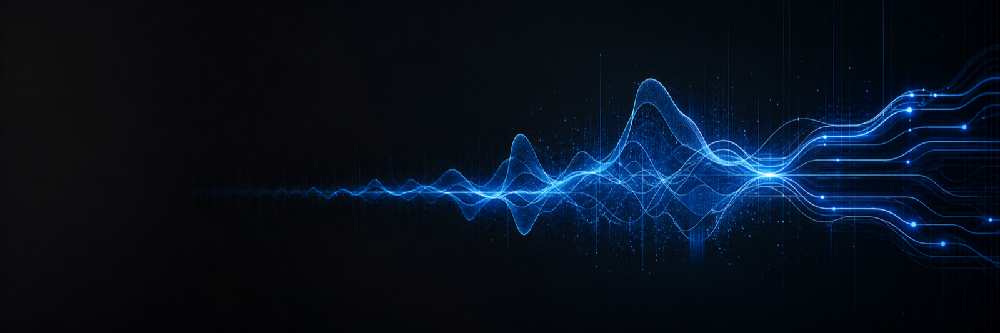

# GainMesh

[English](README.md) · **한국어**

**맥의 모든 소리를, 원하는 스피커로 완벽하게 엮다.**

GainMesh는 시스템 오디오 한 줄기를 여러 스피커로 동시에 보내고, 기기별 볼륨·밸런스·지연을 따로 맞춥니다. 12밴드 파라메트릭 EQ, 27개 실측 커브 프리셋, 시스템 오디오 화면 녹화, 라이브 메뉴 막대 비주얼라이저까지 하나의 네이티브 앱에 담았습니다.

## 1.3.17 주요 개선점

- **소리가 스스로 돌아옵니다.** macOS가 오디오 시스템을 재시작해도(업데이트 후 자주 발생) 다시 실행할 필요 없이 자동으로 다시 연결합니다.
- **정지해도 소리가 갇히지 않습니다.** 종료·정지하면 항상 실제 스피커로 출력을 되돌립니다.
- **CPU 사용량이 크게 줄었습니다.** EQ를 스피커마다가 아니라 한 번만 계산하고(출력 4개 기준 약 3배 절감), 곡 정보는 바뀔 때만 갱신하며, 무음일 때 노치 비주얼은 쉽니다.
- **상태가 한눈에 보입니다.** 메뉴 막대 아이콘이 재생·정지·재연결 중·확인 필요를 구분하고, 복구 중에는 패널에 "오디오 다시 연결 중"이 표시됩니다.
- **더 깔끔한 노치.** 완전한 검은 배경으로 어떤 배경화면에서도 비주얼이 잘 보이고, 앨범 아트를 누르면 재생 중인 앱(없으면 Apple Music)이 열립니다.
- **쉬워진 업데이트.** 새 버전을 한 번 알려 주고, "다운로드"를 누르면 공증된 설치 파일을 받아 서명을 확인한 뒤 바로 설치 프로그램을 엽니다.

전체 사용자 변경 내역은 [CHANGELOG.md](CHANGELOG.md)에서 확인할 수 있습니다.

## GainMesh가 하는 일

- Mac의 같은 소리를 여러 실제 출력 기기에서 동시에 재생합니다.
- 출력 기기마다 볼륨·밸런스·지연을 따로 조정합니다.
- 최대 12밴드 파라메트릭 EQ와 27개 프리셋으로 소리를 다듬습니다.
- 별도 루프백 앱 없이 macOS 화면 녹화에 시스템 오디오를 담습니다.
- 메뉴 막대에서 앨범 이미지·재생 제어·라이브 비주얼을 보여줍니다.

## 요구 사항

| | |
|---|---|
| macOS | 14.2 (Sonoma) 이상 |
| 칩 | Apple silicon (M 시리즈) |
| 권한 | 시스템 오디오 녹음 |
| 관리자 권한 | 설치 시 1회 필요 |
| 재시작 | 설치 후 1회 필요 |

## 설치

1. **[`GainMesh.dmg` 다운로드](../../releases/latest)** 후 엽니다.
2. 디스크 이미지 안의 **`Install GainMesh.pkg`** 를 실행합니다.
3. macOS가 요청하는 관리자 권한을 승인합니다.
4. 설치가 끝나면 **Mac을 재시작**합니다.
5. 재시작 후 `/Applications`에서 **GainMesh**를 실행합니다.
6. **시스템 오디오 녹음** 권한을 승인하고 출력 스피커를 선택합니다.

이 DMG는 앱을 Applications로 끌어다 놓는 설치를 제공하지 않습니다. 통합 설치 프로그램이 두 구성 요소를 함께 설치합니다.

| 구성 요소 | 설치 위치 |
|---|---|
| `GainMesh.app` | `/Applications` |
| `GainMeshDriver.driver` (서명된 HAL 플러그인) | `/Library/Audio/Plug-Ins/HAL` |

**재시작은 선택이 아닙니다.** Core Audio는 새로 설치된 HAL 드라이버를 전체 재시작에서만 읽습니다. 로그아웃이나 `coreaudiod` 재시작으로는 로드되지 않으며, 재시작 전까지는 다중 출력 라우팅이 동작하지 않습니다.

앱과 설치 프로그램은 Apple Developer ID(팀 `8YKYNYSV6L`)로 서명되고 Apple 공증을 받았습니다. Gatekeeper가 정상적으로 열어 주므로 우클릭 열기 같은 우회 절차가 필요 없습니다.

## 첫 실행

GainMesh는 메뉴 막대에서 동작합니다. Dock 아이콘과 별도 메인 창이 없습니다.

1. 메뉴 막대의 GainMesh 아이콘을 클릭합니다.
2. macOS가 묻는 **시스템 오디오 녹음** 권한을 승인합니다. 이 권한이 없으면 시스템 오디오를 가져올 수 없습니다.
3. 소리를 보낼 실제 출력 기기를 선택합니다.
4. 마스터 볼륨을 정한 뒤 기기별 볼륨·밸런스·지연을 조정합니다.
5. 이퀄라이저에서 파라메트릭 밴드, A–D 청음 슬롯, 프리셋 목록을 사용합니다.

권한 요청 창은 한 번만 나타납니다. 닫아버렸다면 **시스템 설정 → 개인정보 보호 및 보안 → 시스템 오디오 녹음**에서 GainMesh를 켠 뒤 앱을 다시 실행하세요.

**GainMesh는 로그인 시 자동으로 실행됩니다.** 설치 프로그램이 이를 미리 설정하므로, 설치 후 재시작하면 GainMesh가 이미 실행된 상태로 올라옵니다. 설정에서 끌 수 있지만, `GainMesh` 기기가 시스템 출력으로 선택된 상태에서는 앱이 실행 중일 때만 소리가 납니다.

맨 처음 실행은 Mac이 이미 쓰고 있던 스피커로 시작합니다. 아무것도 고르기 전에도 소리가 계속 납니다.

## 제거

메뉴 막대의 GainMesh 아이콘을 클릭하고 **…** 메뉴에서 **GainMesh 제거**를 선택하세요. 앱 종료, 로그인 항목 해제, 앱과 HAL 드라이버 삭제, 설정 정리까지 한 번에 처리합니다. 관리자 권한은 한 번만 승인하면 됩니다.

제거 후 Mac을 재시작해야 Core Audio가 드라이버를 놓고 원래 출력 선택으로 돌아갑니다.

앱을 휴지통에 넣는 것만으로는 부족합니다. 드라이버는 `/Library/Audio/Plug-Ins/HAL`에 있고 삭제에 관리자 권한이 필요합니다.

제거 기능이 디스크 이미지가 아니라 앱 안에 있는 이유는, macOS가 다운로드된 스크립트의 더블클릭을 차단하고 셸 스크립트는 공증을 받을 수 없기 때문입니다.

## 문제 해결

**설치 후 소리가 안 납니다.** 아직 재시작하지 않은 경우입니다. macOS를 재시작한 뒤 GainMesh를 다시 실행하세요.

**사운드 설정에 GainMesh 출력이 보이지 않습니다.** HAL 드라이버가 로드되지 않은 상태입니다. `/Library/Audio/Plug-Ins/HAL/GainMeshDriver.driver`가 있는지 확인하고 Mac을 재시작하세요.

**"손상되었다"는 경고가 뜨거나 Gatekeeper가 열지 않습니다.** 다운로드가 중간에 끊겼거나 파일이 변조된 경우입니다. [Releases](../../releases/latest)에서 DMG를 다시 받으세요. 제3자 미러본은 사용하지 마세요.

**볼륨 키가 GainMesh를 따라가지 않습니다.** **시스템 설정 → 사운드 → 출력**에서 `GainMesh` 기기를 시스템 출력으로 선택하세요.

**기기를 바꿀 때 소리가 끊깁니다.** Core Audio가 통합 출력을 다시 구성하는 동안 잠시 기다리세요. 새 기기를 사용할 수 없으면 GainMesh가 이전 선택으로 되돌립니다.

## 언어

GainMesh는 macOS 시스템 언어를 따라 12개 언어(한국어, 영어, 일본어, 중국어 간체·번체, 프랑스어, 독일어, 스페인어, 이탈리아어, 포르투갈어(브라질), 러시아어, 아랍어)를 지원합니다. 설정에서 수동 선택할 수 있고, 목록에 없는 언어는 영어로 표시됩니다.

## 라이선스

개인·비상업적 사용은 무료입니다. 상업적 사용은 별도 허가가 필요합니다. [LICENSE](LICENSE)를 확인하세요.

Copyright © ezBuilder

---

이 저장소에는 공개 문서와 서명·공증된 설치 파일만 있습니다. 제품 소스 코드는 배포하지 않습니다.
